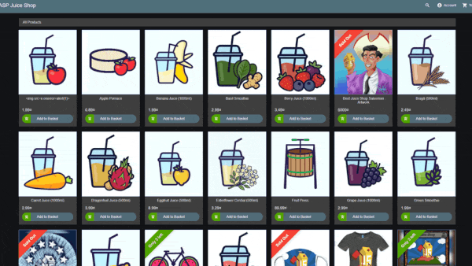

#  OWASP Juice Shop

[](https://owasp.org/projects/#sec-flagships)
[](https://github.com/juice-shop/juice-shop/releases/latest)
[](https://twitter.com/owasp_juiceshop)
[](https://reddit.com/r/owasp_juiceshop)

[](https://github.com/juice-shop/juice-shop/actions/workflows/ci.yml)
[](https://github.com/juice-shop/juice-shop/actions/workflows/release.yml)
[](https://coveralls.io/github/juice-shop/juice-shop?branch=develop)
[](https://dashboard.cypress.io/projects/3hrkhu/runs)
[](https://www.bestpractices.dev/projects/223)

[](CODE_OF_CONDUCT.md)

> [The most trustworthy online shop out there.](https://twitter.com/dschadow/status/706781693504589824)
> ([@dschadow](https://github.com/dschadow)) —
> [The best juice shop on the whole internet!](https://twitter.com/shehackspurple/status/907335357775085568)
> ([@shehackspurple](https://twitter.com/shehackspurple)) —
> [Actually the most bug-free vulnerable application in existence!](https://youtu.be/TXAztSpYpvE?t=26m35s)
> ([@vanderaj](https://twitter.com/vanderaj)) —
> [First you 😂😂then you 😢](https://twitter.com/kramse/status/1073168529405472768)
> ([@kramse](https://twitter.com/kramse)) —
> [But this doesn't have anything to do with juice.](https://twitter.com/coderPatros/status/1199268774626488320)
> ([@coderPatros' wife](https://twitter.com/coderPatros))

OWASP Juice Shop is probably the most modern and sophisticated insecure web application! It can be used in security
trainings, awareness demos, CTFs and as a guinea pig for security tools! Juice Shop encompasses vulnerabilities from the
entire
[OWASP Top Ten](https://owasp.org/www-project-top-ten) along with many other security flaws found in real-world
applications!



For a detailed introduction, full list of features and architecture overview please visit the official project page:
<https://owasp-juice.shop>

## Table of contents

- [Setup](#setup)
    - [Assignment secrets management](#assignment-secrets-management)
    - [From Sources](#from-sources)
    - [Packaged Distributions](#packaged-distributions)
    - [Docker Container](#docker-container)
    - [Vagrant](#vagrant)
- [Demo](#demo)
- [Documentation](#documentation)
    - [Node.js version compatibility](#nodejs-version-compatibility)
    - [Troubleshooting](#troubleshooting)
    - [Official companion guide](#official-companion-guide)
- [Contributing](#contributing)
- [References](#references)
- [Merchandise](#merchandise)
- [Donations](#donations)
- [Contributors](#contributors)
- [Licensing](#licensing)

## Setup

> You can find some less common installation variations as well as instructions to run Juice Shop on a variety of cloud computing providers in
> [the _Running OWASP Juice Shop_ documentation](https://pwning.owasp-juice.shop/companion-guide/latest/part1/running.html).

> Some challenges require an AI/LLM provider to work properly. Check the
> [_Setting up external dependencies_ documentation](https://pwning.owasp-juice.shop/companion-guide/snapshot/part1/running.html#_setting_up_external_dependencies)
> for instructions on configuring local or cloud-based AI providers.

### Assignment secrets management

The application reads secrets from its process environment. No external-service
credentials are required for basic startup. The root `.env.example` contains only
empty placeholders:

- `ALCHEMY_API_KEY`: optional Alchemy access for the Web3 challenges.
- `LLM_API_KEY`: optional authentication for the configured LLM provider; the
  default local Ollama configuration does not require this key.
- `SOLUTIONS_WEBHOOK`: optional challenge-solution notification URL. Leave it
  empty for the assignment demonstration. The application currently logs this
  URL, so do not supply a credential-bearing URL without addressing that logging.
- `CTF_KEY`: optional private override for CTF flag generation. An empty value
  retains the bundled `ctf.key` training fallback.

For local configuration, copy `.env.example` to `.env` in the repository root and
edit only the values needed for your setup. Keep this file private. After installing
dependencies and building the application, start it from the repository root with:

```shell
node --env-file=.env build/app
```

This command explicitly loads the file; `npm start` does **not** automatically
load `.env`. Alternatively, set process environment variables before `npm start`.
Existing process environment values take precedence over Node's environment file.

For Docker Compose, run `docker compose up --build` from the repository root.
Compose reads the root `.env` for interpolation, and the service explicitly passes
the four variables to the container at runtime. Host environment values take
precedence over `.env`. Missing or empty values retain the application's existing
defaults; `.env` is not required for basic Compose startup. Git ignores `.env` and
`.env.*` except `.env.example`. Docker excludes `.env` and `.env.*` at all directory
levels, including `.env.example`, from the build context. These rules do not
protect secrets stored under other filenames.
Secrets must not be placed in Docker build arguments or image layers.

#### GitHub Secrets demonstration

After the separately approved repository configuration step, a collaborator can
create `MEMBER3_DEMO_SECRET` under **Settings > Secrets and variables > Actions >
New repository secret**. Use a private, disposable demonstration value with no
external-service access. No Alchemy, LLM, webhook or CTF credential is needed.

Once `secrets-management-demo.yml` exists on the default branch, select **Actions >
Secrets Management Demonstration > Run workflow**. This manual workflow maps the
GitHub encrypted secret into a step-scoped environment variable, fails if it is
empty, and prints only a fixed success message. It performs no checkout and has
no token permissions. It does not change the existing security gates.

This proves GitHub Secret-to-workflow injection and presence, not application
consumption or successful authentication with an external service. Application
runtime provisioning uses the local or Compose paths described above. Existing
CI references to `ALCHEMY_API_KEY` and `E2E_SOLUTIONS_WEBHOOK` do not establish that
those repository secrets have been configured.

#### Handling and evidence

Never commit real credentials or paste them into commands, screenshots, reports
or logs. Avoid environment dumps and expanded Compose configuration output when
secrets are configured. Restrict repository access to trusted collaborators and
replace secrets through their private configuration source when rotating them.
If a real credential is disclosed, revoke or rotate it at its provider first and
coordinate removal from exposed files and history; adding an ignore rule does
not remove an already tracked secret.

Capture the saved GitHub Secret **name only**, the workflow's fixed success
message and commit reference, and runtime verification that reports only
presence/success. In the assignment report (Sections 2.5 and 3.3), explain both
provisioning paths, access and rotation, and the limits of the evidence. Document
Member 3's contribution and AI assistance in the group contribution statement.
The existing Gitleaks exceptions cover inherited training fixtures; they do not
remove those values from history or establish that all assignment requirements
are satisfied. Distinguish these fixtures from operational secrets and clarify
their acceptability with the lecturer.

References: [GitHub encrypted secrets](https://docs.github.com/en/actions/how-tos/write-workflows/choose-what-workflows-do/use-secrets),
[Compose environment variables](https://docs.docker.com/compose/how-tos/environment-variables/set-environment-variables/),
and [Node environment-file loading](https://nodejs.org/api/cli.html#--env-filefile).

### From Sources


1. Install [node.js](#nodejs-version-compatibility)
2. Run `git clone https://github.com/juice-shop/juice-shop.git --depth 1` (or
   clone [your own fork](https://github.com/juice-shop/juice-shop/fork)
   of the repository)
3. Go into the cloned folder with `cd juice-shop`
4. Run `npm install` (only has to be done before first start or when you change the source code)
5. Run `npm start`
6. Browse to <http://localhost:3000>

### Packaged Distributions

[](https://github.com/juice-shop/juice-shop/releases/latest)
[](https://sourceforge.net/projects/juice-shop/)
[](https://sourceforge.net/projects/juice-shop/)

1. Install a 64bit [node.js](#nodejs-version-compatibility) on your Windows, MacOS or Linux machine
2. Download `juice-shop-<version>_<node-version>_<os>_x64.zip` (or
   `.tgz`) attached to
   [latest release](https://github.com/juice-shop/juice-shop/releases/latest)
3. Unpack and `cd` into the unpacked folder
4. Run `npm start`
5. Browse to <http://localhost:3000>

> Each packaged distribution includes some binaries for `sqlite3` and
> `libxmljs2` bound to the OS and node.js version which `npm install` was
> executed on.

### Docker Container

[](https://hub.docker.com/r/bkimminich/juice-shop)

[](https://microbadger.com/images/bkimminich/juice-shop
"Get your own image badge on microbadger.com")
[](https://microbadger.com/images/bkimminich/juice-shop
"Get your own version badge on microbadger.com")

1. Install [Docker](https://www.docker.com)
2. Run `docker pull bkimminich/juice-shop`
3. Run `docker run --rm -p 127.0.0.1:3000:3000 bkimminich/juice-shop`
4. Browse to <http://localhost:3000> (on macOS and Windows browse to
   <http://192.168.99.100:3000> if you are using docker-machine instead of the native docker installation)

### Vagrant

1. Install [Vagrant](https://www.vagrantup.com/downloads.html) and
   [Virtualbox](https://www.virtualbox.org/wiki/Downloads)
2. Run `git clone https://github.com/juice-shop/juice-shop.git` (or
   clone [your own fork](https://github.com/juice-shop/juice-shop/fork)
   of the repository)
3. Run `cd vagrant && vagrant up`
4. Browse to [192.168.56.110](http://192.168.56.110)

## Demo

Feel free to have a look at the latest version of OWASP Juice Shop:
<http://demo.owasp-juice.shop>

> This is a deployment-test and sneak-peek instance only! You are __not
> supposed__ to use this instance for your own hacking endeavours! No
> guaranteed uptime! Guaranteed stern looks if you break it!

## Documentation

### Node.js version compatibility


OWASP Juice Shop officially supports the following versions of
[node.js](http://nodejs.org) in line with the official
[node.js LTS schedule](https://github.com/nodejs/LTS) as close as possible. Docker images and packaged distributions are
offered accordingly.

| node.js | Supported              | Tested             | [Packaged Distributions](#packaged-distributions) | [Docker images](#docker-container) from `master` | [Docker images](#docker-container) from `develop` |
|:--------|:-----------------------|:-------------------|:--------------------------------------------------|:-------------------------------------------------|:--------------------------------------------------|
| 26.x    | :heavy_check_mark:     | :heavy_check_mark: |                                                   |                                                  |                                                   |
| 25.x    | ( :heavy_check_mark: ) | :x:                |                                                   |                                                  |                                                   |
| 24.x    | :heavy_check_mark:     | :heavy_check_mark: | Windows (`x64`), MacOS (`x64`), Linux (`x64`)     | `latest` (`linux/amd64`, `linux/arm64`)          | `snapshot` (`linux/amd64`, `linux/arm64`)         |
| 23.x    | :x:                    | :x:                |                                                   |                                                  |                                                   |
| 22.x    | :heavy_check_mark:     | :heavy_check_mark: |                                                   |                                                  |                                                   |
| <22.x   | :x:                    | :x:                |                                                   |                                                  |                                                   |

Juice Shop is automatically tested _only on the latest `.x` minor version_ of each node.js version mentioned above!
There is no guarantee that older minor node.js releases will always work with Juice Shop!
Please make sure you stay up to date with your chosen version.

### Troubleshooting

[](https://gitter.im/bkimminich/juice-shop)

If you need help with the application setup please check 
[our existing _Troubleshooting_](https://pwning.owasp-juice.shop/companion-guide/latest/part4/troubleshooting.html)
guide. If this does not solve your issue please post your specific problem or question in the
[Gitter Chat](https://gitter.im/bkimminich/juice-shop) where community members can best try to help you.

:stop_sign: **Please avoid opening GitHub issues for support requests or questions!**

### Official companion guide

[](https://www.goodreads.com/review/edit/49557240)

OWASP Juice Shop comes with an official companion guide eBook. It will give you a complete overview of all
vulnerabilities found in the application including hints how to spot and exploit them. In the appendix you will even
find complete step-by-step solutions to every challenge. Extensive documentation of
[custom re-branding](https://pwning.owasp-juice.shop/companion-guide/latest/part4/customization.html),
[CTF-support](https://pwning.owasp-juice.shop/companion-guide/latest/part4/ctf.html),
[trainer's guide](https://pwning.owasp-juice.shop/companion-guide/latest/part4/trainers.html)
and much more is also included.

[Pwning OWASP Juice Shop](https://leanpub.com/juice-shop) is published under
[CC BY-NC-ND 4.0](https://creativecommons.org/licenses/by-nc-nd/4.0/)
and is available **for free** in PDF, Kindle and ePub format on LeanPub. You can also
[browse the full content online](https://pwning.owasp-juice.shop)!

[](https://leanpub.com/juice-shop)
[](https://leanpub.com/juice-shop)

## Contributing

[](https://github.com/juice-shop/juice-shop/graphs/contributors)
[](http://standardjs.com/)
[](https://crowdin.com/project/owasp-juice-shop)


We are always happy to get new contributors on board! Please check
[CONTRIBUTING.md](CONTRIBUTING.md) to learn how to
[contribute to our codebase](CONTRIBUTING.md#code-contributions) or the
[translation into different languages](CONTRIBUTING.md#i18n-contributions)!

## References

Did you write a blog post, magazine article or do a podcast about or mentioning OWASP Juice Shop? Or maybe you held or
joined a conference talk or meetup session, a hacking workshop or public training where this project was mentioned?

Add it to our ever-growing list of [REFERENCES.md](REFERENCES.md) by forking and opening a Pull Request!

## Merchandise

* On [Spreadshirt.com](http://shop.spreadshirt.com/juiceshop) and
  [Spreadshirt.de](http://shop.spreadshirt.de/juiceshop) you can get some swag (Shirts, Hoodies, Mugs) with the official
  OWASP Juice Shop logo
* On
  [StickerYou.com](https://www.stickeryou.com/products/owasp-juice-shop/794)
  you can get variants of the OWASP Juice Shop logo as single stickers to decorate your laptop with. They can also print
  magnets, iron-ons, sticker sheets and temporary tattoos.

## Donations

[](https://owasp.org/donate/?reponame=www-project-juice-shop&title=OWASP+Juice+Shop)

The OWASP Foundation gratefully accepts donations via Stripe. Projects such as Juice Shop can then request reimbursement
for expenses from the Foundation. If you'd like to express your support of the Juice Shop project, please make sure to
tick the "Publicly list me as a supporter of OWASP Juice Shop" checkbox on the donation form. You can find our more
about donations and how they are used here:

<https://pwning.owasp-juice.shop/companion-guide/latest/part3/donations.html>

## Contributors

The OWASP Juice Shop Project Leaders are:

- [Björn Kimminich](https://github.com/bkimminich) aka `bkimminich` [](https://keybase.io/bkimminich)
- [Jannik Hollenbach](https://github.com/J12934) aka `J12934`

For a list of all contributors to the OWASP Juice Shop please visit our
[HALL_OF_FAME.md](HALL_OF_FAME.md).

## Licensing

[](LICENSE)

This program is free software: you can redistribute it and/or modify it under the terms of the [MIT license](LICENSE).
OWASP Juice Shop and any contributions are Copyright © by Bjoern Kimminich & the OWASP Juice Shop contributors
2014-2026.


